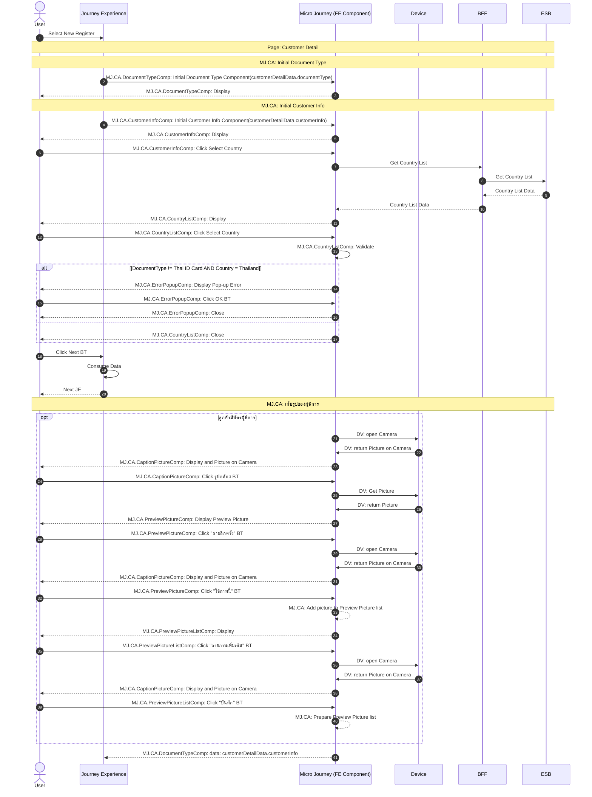

```mermaid
sequenceDiagram
    autonumber
    actor User
    participant JE as Journey Experience
    participant MJ as Micro Journey (FE Component)
    participant DV as Device
    participant BFF    
    participant ESB

   
    
    User->>JE: Select New Register

    Note over User, ESB: Page: Customer Detail

    Note over User, ESB: MJ.CA: Initial Document Type
    JE->>MJ: MJ.CA.DocumentTypeComp: Initial Document Type Component(customerDetailData.documentType)
    MJ-->>User: MJ.CA.DocumentTypeComp: Display 

    Note over User, ESB: MJ.CA: Initial Customer Info
    JE->>MJ: MJ.CA.CustomerInfoComp: Initial Customer Info Component(customerDetailData.customerInfo)
    MJ-->>User: MJ.CA.CustomerInfoComp: Display

    User->>MJ: MJ.CA.CustomerInfoComp: Click Select Country
    #JE->>MJ: MJ.CA.CustomerInfoComp:Get Country List ()
    MJ->>BFF: Get Country List
    BFF->>ESB: Get Country List
    ESB-->>BFF: Country List Data
    BFF-->>MJ: Country List Data
    MJ-->>User: MJ.CA.CountryListComp: Display 
    User->>MJ: MJ.CA.CountryListComp: Click Select Country

    MJ->>MJ: MJ.CA.CountryListComp: Validate
    alt [DocumentType != Thai ID Card AND Country = Thailand]
        MJ-->>User: MJ.CA.ErrorPopupComp: Display Pop-up Error
        User->>MJ: MJ.CA.ErrorPopupComp: Click OK BT
        MJ-->>User: MJ.CA.ErrorPopupComp: Close
    else  
        MJ-->>User: MJ.CA.CountryListComp: Close 
        #JE->>MJ: MJ.CA.CustomerDetailComp: Get Customer Detail Data
    end

    #MJ-->>User: MJ.CA.CountryListComp: Close 

    #JE-->>User: Display Customer Detail Page

    # Note over User, ESB: MJ.CA: Next Page
    User->>JE: Click Next BT
    JE->>JE: Consume Data
    JE-->>User: Next JE


    #MJ->>MJ: MJ.CA.CountryListComp: Validate
    #alt [DocumentType = Passport AND Country = Thailand]
        #MJ-->>User: MJ.CA.CountryListComp: Display Pop-up Error
        #User->>MJ: MJ.CA.CountryListComp: Click OK BT
        #MJ-->>User: MJ.CA.CountryListComp: Display
    #else 
        #JE->>MJ: MJ.CA.CustomerDetailComp: Get Customer Detail Data
    #end

    #JE->>MJ: MJ.CA.DocumentTypeComp: Get Data 
    #MJ-->>JE: MJ.CA.DocumentTypeComp: data: customerDetailData.documentType

    #JE->>MJ: MJ.CA.CustomerInfoComp: Get Data
   
    
    Note over User, ESB: MJ.CA: เก็บรูปของผู้พิการ
    opt ลูกค้ามีบัตรผู้พิการ
        #MJ-->>User: MJ.CA.CaptionPictureComp: Display with S
        #JE->>MJ: MJ.CA:call Cap Pictures Of Disabilities function
        MJ->>DV: DV: open Camera
        DV->>MJ: DV: return Picture on Camera
        MJ-->>User: MJ.CA.CaptionPictureComp: Display and Picture on Camera
       # JE-->>User: Display Preview Picture     

        User->>MJ: MJ.CA.CaptionPictureComp: Click รูปกล้อง BT
        MJ->>DV: DV: Get Picture
        DV->>MJ: DV: return Picture
        MJ-->>User: MJ.CA.PreviewPictureComp: Display Preview Picture  

        User->>MJ: MJ.CA.PreviewPictureComp: Click "ถ่ายอีกครั้ง" BT
        MJ->>DV: DV: open Camera
        DV->>MJ: DV: return Picture on Camera
        MJ-->>User: MJ.CA.CaptionPictureComp: Display and Picture on Camera

        User->>MJ: MJ.CA.PreviewPictureComp: Click "ใช้ภาพนี้" BT
        MJ-->>MJ: MJ.CA: Add picture to Preview Picture list
        MJ-->>User: MJ.CA.PreviewPictureListComp: Display 

        User->>MJ: MJ.CA.PreviewPictureListComp: Click "ถ่ายภาพเพิ่มเติม" BT
        MJ->>DV: DV: open Camera
        DV->>MJ: DV: return Picture on Camera
        MJ-->>User: MJ.CA.CaptionPictureComp: Display and Picture on Camera 

        User->>MJ: MJ.CA.PreviewPictureListComp: Click "บันทึก" BT
        MJ-->>MJ: MJ.CA: Prepare Preview Picture list
        


        
        #JE->>MJ: MJ.CA: store Pictures Of Disabilities function
       # MJ->>JE: MJ.CA: response
    end
    MJ-->>JE: MJ.CA.DocumentTypeComp: data: customerDetailData.customerInfo
    #MJ->>JE: MJ.CA: Customer Detail Component(customerInfo) response(End)


```
   

   
    
