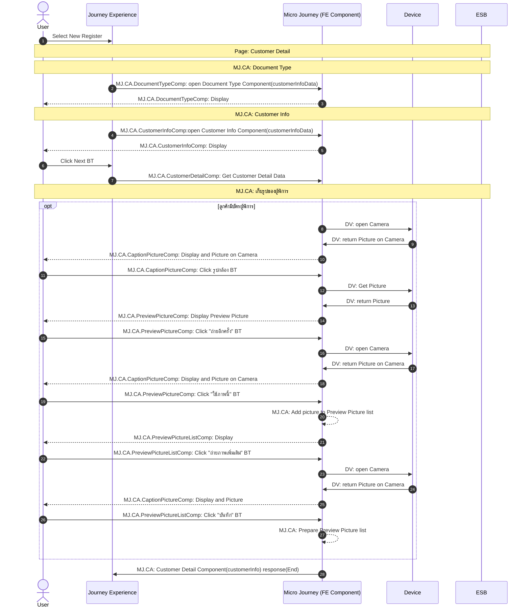

```mermaid
sequenceDiagram
    autonumber
    actor User
    participant JE as Journey Experience
    participant MJ as Micro Journey (FE Component)
    participant DV as Device
    #participant BFF    
    participant ESB

   
    
    User->>JE: Select New Register

    Note over User, ESB: Page: Customer Detail

    Note over User, ESB: MJ.CA: Document Type
    JE->>MJ: MJ.CA.DocumentTypeComp: open Document Type Component(customerInfoData)
    MJ-->>User: MJ.CA.DocumentTypeComp: Display 

    Note over User, ESB: MJ.CA: Customer Info
    JE->>MJ: MJ.CA.CustomerInfoComp:open Customer Info Component(customerInfoData)
    MJ-->>User: MJ.CA.CustomerInfoComp: Display

    #JE-->>User: Display Customer Detail Page

    # Note over User, ESB: MJ.CA: Next Page
    User->>JE: Click Next BT
    JE->>MJ: MJ.CA.CustomerDetailComp: Get Customer Detail Data
    
    Note over User, ESB: MJ.CA: เก็บรูปของผู้พิการ
    opt ลูกค้ามีบัตรผู้พิการ
        #MJ-->>User: MJ.CA.CaptionPictureComp: Display with S
        #JE->>MJ: MJ.CA:call Cap Pictures Of Disabilities function
        MJ->>DV: DV: open Camera
        DV->>MJ: DV: return Picture on Camera
        MJ-->>User: MJ.CA.CaptionPictureComp: Display and Picture on Camera
       # JE-->>User: Display Preview Picture     

        User->>MJ: MJ.CA.CaptionPictureComp: Click รูปกล้อง BT
        MJ->>DV: DV: Get Picture
        DV->>MJ: DV: return Picture
        MJ-->>User: MJ.CA.PreviewPictureComp: Display Preview Picture  

        User->>MJ: MJ.CA.PreviewPictureComp: Click "ถ่ายอีกครั้ง" BT
        MJ->>DV: DV: open Camera
        DV->>MJ: DV: return Picture on Camera
        MJ-->>User: MJ.CA.CaptionPictureComp: Display and Picture on Camera

        User->>MJ: MJ.CA.PreviewPictureComp: Click "ใช้ภาพนี้" BT
        MJ-->>MJ: MJ.CA: Add picture to Preview Picture list
        MJ-->>User: MJ.CA.PreviewPictureListComp: Display 

        User->>MJ: MJ.CA.PreviewPictureListComp: Click "ถ่ายภาพเพิ่มเติม" BT
        MJ->>DV: DV: open Camera
        DV->>MJ: DV: return Picture on Camera
        MJ-->>User: MJ.CA.CaptionPictureComp: Display and Picture 

        User->>MJ: MJ.CA.PreviewPictureListComp: Click "บันทึก" BT
        MJ-->>MJ: MJ.CA: Prepare Preview Picture list
        


        
        #JE->>MJ: MJ.CA: store Pictures Of Disabilities function
       # MJ->>JE: MJ.CA: response
    end

    MJ->>JE: MJ.CA: Customer Detail Component(customerInfo) response(End)
```
   

   
    
