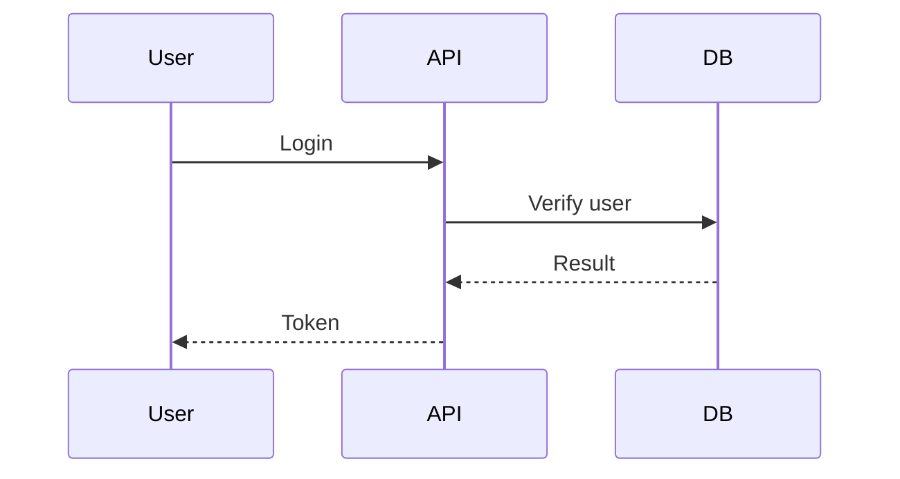
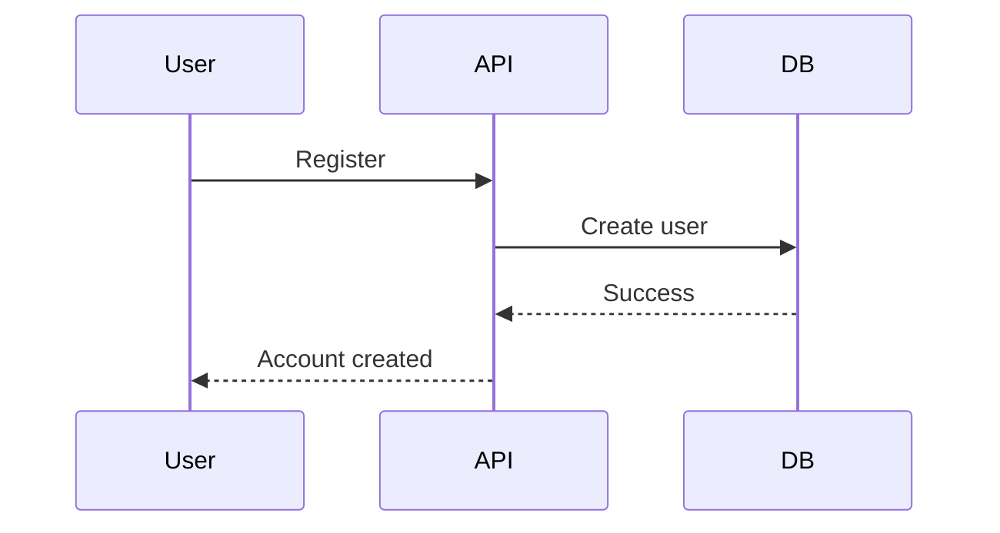

# Login Flow

```mermaid
sequenceDiagram
User->>API: Login
API->>DB: Verify user
DB-->>API: Result
API-->>User: Token
```

## Register Flow

```mermaid
sequenceDiagram
User->>API: Register
API->>DB: Create user
DB-->>API: Success
API-->>User: Account created
```
