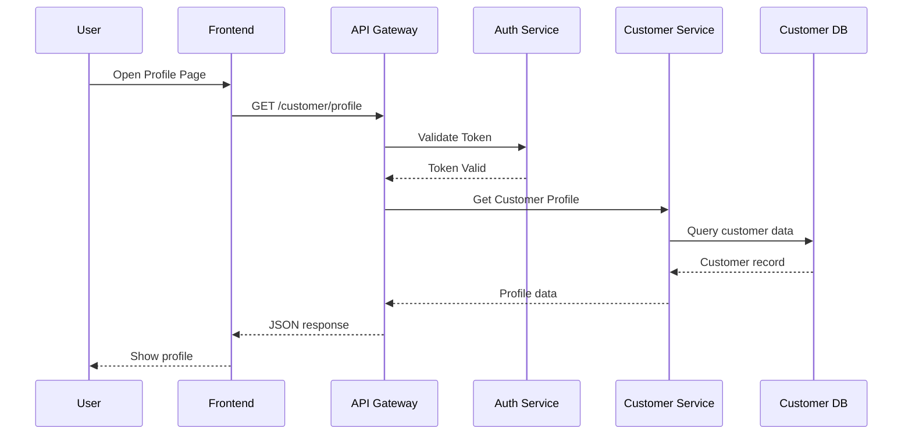
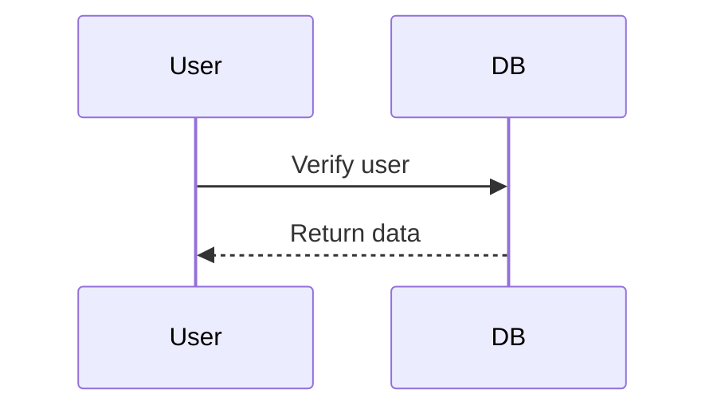
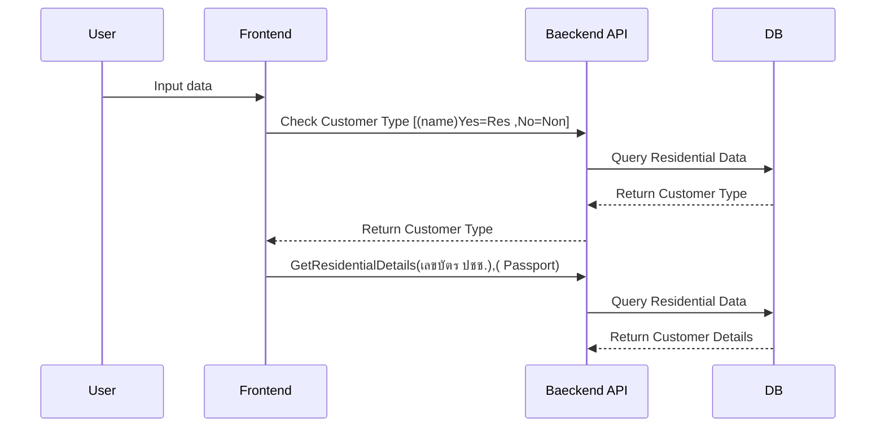

# Customer Profile Flow

```mermaid
sequenceDiagram
User->>Frontend: Open Profile Page
Frontend->>API Gateway: GET /customer/profile
API Gateway->>Auth Service: Validate Token
Auth Service-->>API Gateway: Token Valid

API Gateway->>Customer Service: Get Customer Profile
Customer Service->>Customer DB: Query customer data
Customer DB-->>Customer Service: Customer record

Customer Service-->>API Gateway: Profile data
API Gateway-->>Frontend: JSON response
Frontend-->>User: Show profile
```

# Verify Customer Type

```mermaid
sequenceDiagram
User->>DB: Verify user
DB-->>User: Return data
```

# Fill-in Residential Customer Details

``` mermaid
sequenceDiagram
User->>Frontend: Input data
Frontend->>Baeckend API: Check Customer Type [(name)Yes=Res ,No=Non]
Baeckend API->>DB: Query Residential Data
DB-->>Baeckend API: Return Customer Type
Baeckend API-->>Frontend:  Return Customer Type

Frontend->>Baeckend API: GetResidentialDetails(เลขบัตร ปชช.),( Passport)
Baeckend API->>DB: Query Residential Data
DB-->>Baeckend API: Return Customer Details
```
