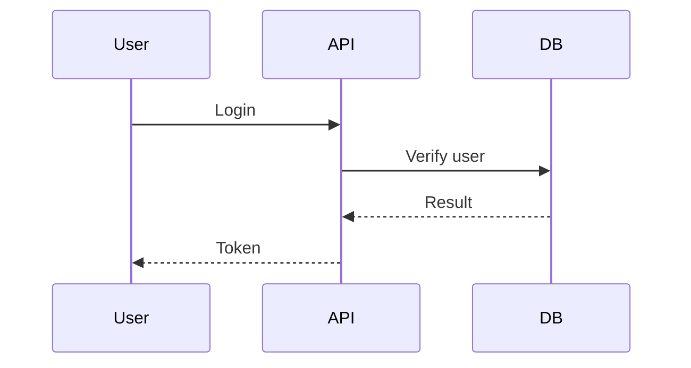
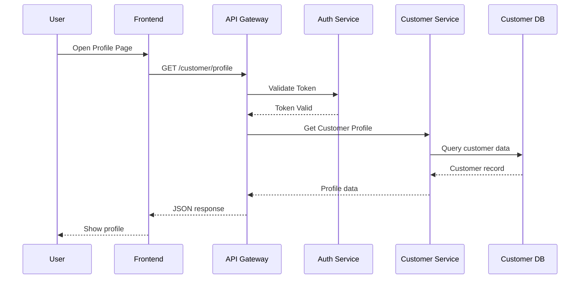

# Login Flow

```mermaid
sequenceDiagram
User->>API: Login
API->>DB: Verify user
DB-->>API: Result
API-->>User: Token
```

# Customer Profile Flow

```mermaid
sequenceDiagram
User->>Frontend: Open Profile Page
Frontend->>API Gateway: GET /customer/profile
API Gateway->>Auth Service: Validate Token
Auth Service-->>API Gateway: Token Valid

API Gateway->>Customer Service: Get Customer Profile
Customer Service->>Customer DB: Query customer data
Customer DB-->>Customer Service: Customer record

Customer Service-->>API Gateway: Profile data
API Gateway-->>Frontend: JSON response
Frontend-->>User: Show profile
```

