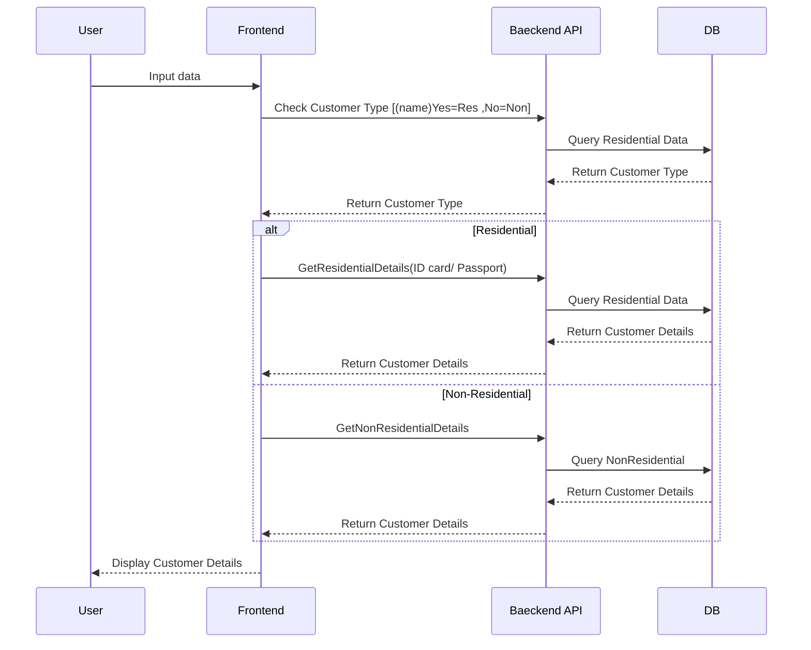

# Fill-in Residential Customer Details



# UI Mockup Dashboard Project

นี่คือตัวอย่างการออกแบบโครงสร้างหน้าจอ (Wireframe) โดยใช้ **Mermaid.js** ซึ่งเน้นความสะอาดของโค้ดและลด Error ในการประมวลผล

### 1. โครงสร้างหน้าจอหลัก (Main Dashboard)

```mermaid
---
title: Product Browse - Number MJ - Initial Access (Odyssey Framework)
---
sequenceDiagram
    actor Staff
    participant CJ as Calling Journey (Host)
    participant NMJ as Number MJ (FE Component)
    participant BFF
    participant Redis as Redis Cache
    participant ESB

    Note over Staff, ESB: Step 1: Mount Micro Journey
    
    Staff->>CJ: Select SIM/eSIM
    CJ->>NMJ: Mount Component

    Note over Staff, ESB: Step 2: Component Initialization
    
    NMJ->>NMJ: Initialize state<br/>- pageNumber = 1<br/>- pageSize = 20<br/>- filters cleared<br/>- selectedNumber = null<br/>- confirm disabled
    NMJ-->>Staff: Display Loading State

    Note over Staff, ESB: Step 3: Initial Data Load
    
    NMJ->>+BFF: listNumbers(simCategory=POSTPAID)
    BFF->>Redis: Validate token
    Redis-->>BFF: Token status
    
    alt Invalid Session
        BFF-->>-NMJ: INVALID_SESSION
        NMJ-->>Staff: Redirect to Login
    else Valid Session
        %% หมายเหตุ: ในภาพต้นฉบับส่วนนี้เป็นลูกศรสีแดง
        BFF->>ESB: ?
        ESB-->>BFF: ?
        BFF-->>NMJ: Number List
        NMJ-->>Staff: Display Number List
    end